# My Modularized HOTAS
A modularized, mostly 3D printed HOTAS with HID emulation via Arduino

## Motivation
On Christmas 2020 I stumbled over [Elite Dangerous](https://www.elitedangerous.com/) and got hooked. After a while I began to play it in VR.
At this point I realized I would need a HOTAS system. The problem was that through the pademic all systems were mostly sold out. 
I had already a joystick so I built a throttle lever made of metal parts, wood and some electronics. And it served me pretty well.

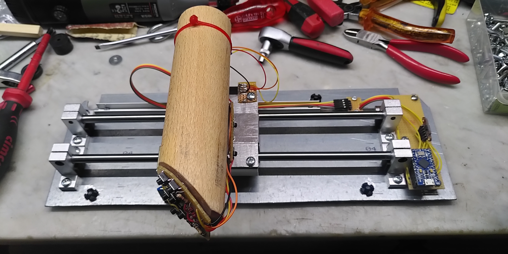

But after hundreds of hours I recognized that the simple push buttons got weak and that I would need more buttons for effective playing in VR.
In 2021 I bought a 3D printer and the idea was born to contruct a new and better throttle lever and maybe after this a new joystick.

## Goals
- As much 3D printed parts as possible and reasonable
- Modularized design for easy printing, assembly, customization and repair

## Current state
See [here](./status.md)

## Concepts
See [here](./concepts.md)

## External parts
For this project additional parts/components are needed besides the 3D printed ones.

| ID     | Ammount   | Item                   | Picture                             | Example link for buying                                                                                                   |
|----------|---------|------------------------|-------------------------------------|---------------------------------------------------------------------------------------------------------------------------|
| CON3     |      3  | Connector 3 pins       | 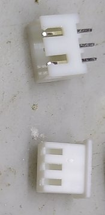 | |
| CON5     |      1  | Connector 5 pins       | 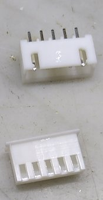| |
| MS       |      4  | Micro swith            | 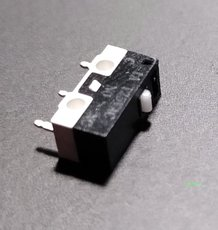 | [Link](https://www.ebay.com/sch/i.html?_from=R40&_trksid=p2380057.m570.l1313&_nkw=micro+limit+switch+125V+1A&_sacat=0) | 
| PB       |     10  | Push button            | 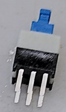  | [Link](https://www.ebay.com/sch/i.html?_from=R40&_trksid=p2380057.m570.l1313&_nkw=micro+button+7mm+non+latching&_sacat=0) |
| SC25     |      4  | Screw 2,5x13 (metric)  | 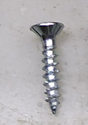 | |
| SCM3     |      1  | Screw M3x20 (metric)   | 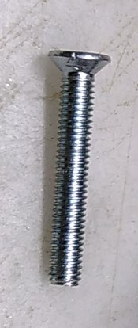 | |
| SC35_7   |      1  | Screw 3,5x7 (metric)   | 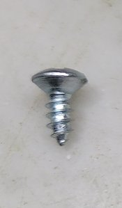 | |
| SC35_95  |      4  | Screw 3,5x9,5 (metric) | 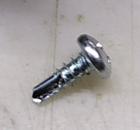 | |
| SCM4_10  |      8  | Screw M4x10 (metric)   | 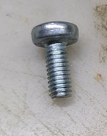 | |
| SCM4_20  |      2  | Screw M4x20 (metric)   | 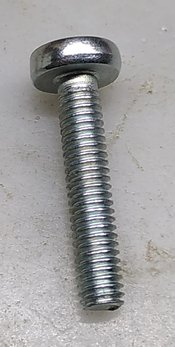 | |
| SCN4     |      2  | Stop nut M4 (metric)   | 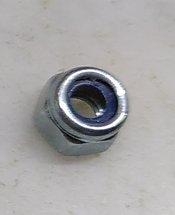 | |

## Toolchain
- [FreeCAD](https://www.freecad.org/) 0.19
- [Cura](https://ultimaker.com/software/ultimaker-cura) 4.12.1 (or above)
- [Creality Ender 6](https://www.creality.com/goods-detail/ender-6-3d-printer) (modified)
- [Arduino IDE](https://www.arduino.cc/en/software)
- [KiCad](https://www.kicad.org/)

## License
This projects is licensed under the terms of [CC BY-NC 4.0](https://creativecommons.org/licenses/by-nc/4.0/)
