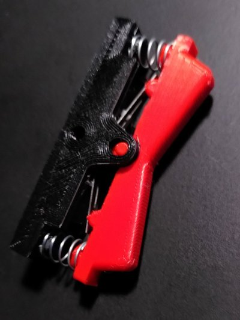

# Status
This file will be a kind of diary for the projects, to document the progress

## 06. Feb 2022
Replaced the metal base plate by a thin printed prototype to check if the holes where at the richt position. On the base plate there will a joint to connect it with the leverl.

## 31. Jan 2022
I created the first test pieces for the adjustable joint. With that it should possible to adjust the angle of the lever in relation to the horizontal line.
This was my third try after evaluating other designs.

## 20. Jan 2022
I did a small revision of the rocker switch module. Its slightly smaller and have holes to reduce material. The rocker itself is black because I was too lazy to change the filament for the test print. ^^

## 14. Jan 2022
Today I printed the early version of parts for the rocker switch and assembled them with the switches and springs.

