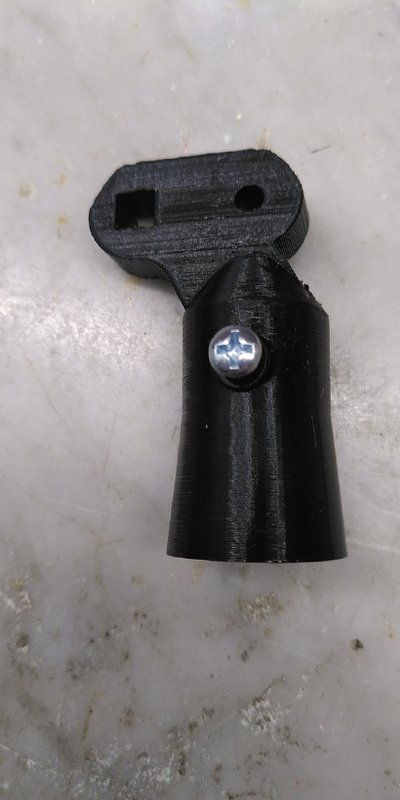

# Status
This file will be a kind of diary for the projects, to document the progress

## 20. Aug 2022
I designes the right part of the lever where many of the cottuns an the HAT will be located. The print went pretty well.

I am also struggeling designing the button modules. The problem is that the swithes I wanted to use arent pretty compact. So I ordered some others at EBAY hoping that they are as reliable as the old ones.

## 11. Aug 2022
I designed and printed additional parts for test reasons.

The consists of:
- Two stoppers to set horizontal angle
- Connector and connection plate to connect the lever with the joint with possible rotation around a additional axe
- Partial printed lever hull, which constists of two parts but I put them too close while printing this time
- Stopper to adjust rotation angle of the lever around its inner axe, not completely assembled

The result is promising but I also identified some weak points.

There is also room for some optimizations like the ammount of needed material.

## 07. Aug 2022
I did a second prototype for a part of the joint that will connect lever and baseplate. With the screw the joint can be fixed in its position. The print wan't 100% accurate but luckily it was at a non-critival point.

## 06. Jun 2022
I redesigned the base plate to reduce need of filament. Additionally I replaced the original lock-in position by a kind of gear to allow finer angles of adjustment around the vertical axe.
I also do a test print ob the counterpart for it.

  

## 07. Feb 2022
Printed the first version of the base plate with joint. We will see if the joint is strong and stiff enough.

## 06. Feb 2022
Replaced the original metal base plate by a thin printed prototype to check if the holes where at the right position. On the base plate there will a joint to connect it with the leverl.

## 31. Jan 2022
I created the first test pieces for the adjustable joint. With that it should possible to adjust the angle of the lever in relation to the horizontal line. This was my third try after evaluating other designs.

## 20. Jan 2022
I did a small revision of the rocker switch module. Its slightly smaller and have holes to reduce material. The rocker itself is black because I was too lazy to change the filament for the test print. ^^

## 14. Jan 2022
Today I printed the early version of parts for the rocker switch and assembled them with the switches and springs.

