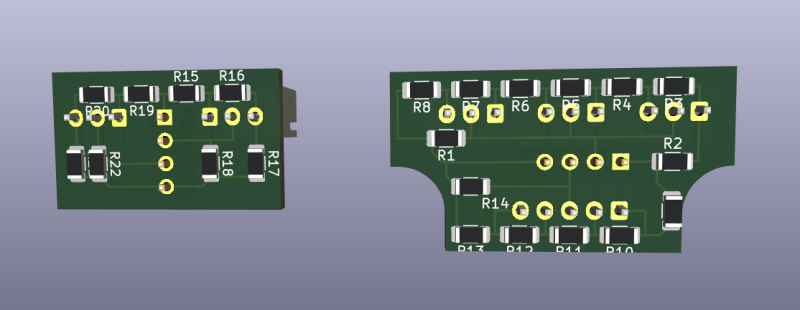
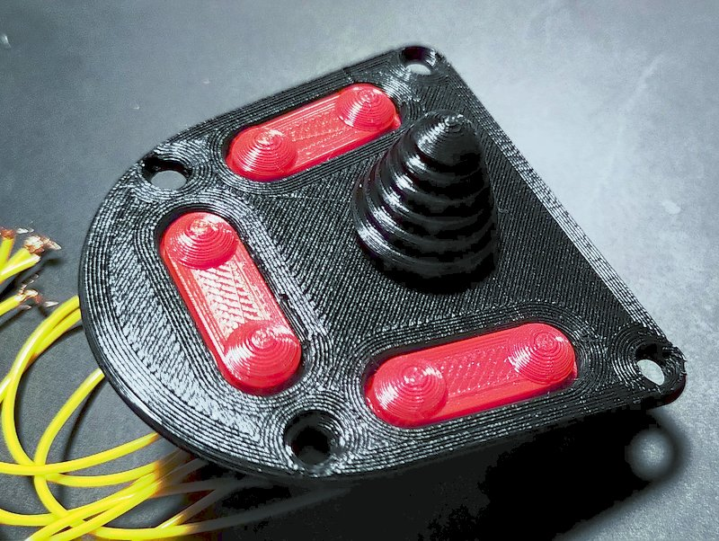
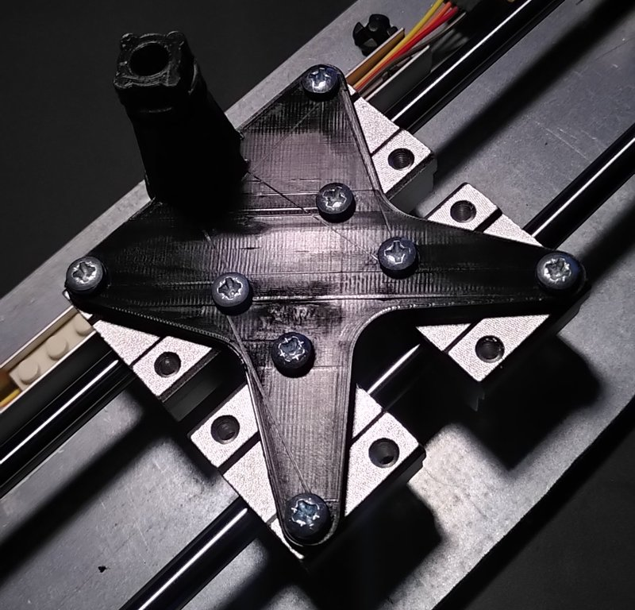

# Status
This file will be a kind of diary for the projects, to document the progress

## 26. Oct 2002
I designed the connector boards with KiCad. These boards will be connected to the buttons and will translate them into analogue signals for the slave Arduino. Maybe this will not be the final design.

I also created a physical version, but its not perfect. So I consider to call it prototype.

Besides that I began to program the slave arduino. Results are promising so far.

## 19. Oct 2022
I reached a major milestone within this project. All basic parts of the lever are designed and printed. 

Not all is perfect but I think it will go through some iterations while using it, but for now I am happy wight the result.

The next phase will be wiring alle the buttons, create connector boards and programming the controller. Challenging will be the limited space within the lever.

## 18. Oct 2022
I finally printed the two parts of the lever hull. I printed them separately in two runs. At the first part I struggled to strip the support structure away. So at the second
part I used tree support.

There a still some little tasks ahead: 
- reprint of the lever angle stopper -> seems to be too small
- print the final version of the rocker
- print the final version of the rocker module
- designing and printing the front buttons of the lever

## 08. Oct 2022
I redesigned the rocker module to use the new push buttons and omitting the springs.

## 03. Oct 2022
The right pannel is now fully assembled and wired. One major step is done.

Next phase is the final design for the lever corpus.

## 28. Sep 2022
It took four attemps to print a perfect fitting HAT. I am pretty happy how it worked out finally. The next step will be to create an assembly description with the needed screws and other parts.

## 27. Sep 2022
The right panel makes progress. I printed the cover plate an the double button caps. The next step will be printing the HAT and add the missing wires.

## 26. Sep 2022
At the moment I am eager to play Elite Dangerous again, so I am pretty motivated to push this project foreward ;)
Today I printed the (maybe final) panel for the buttons and the HAT module. I also printed a button cap prototype.
A small problem will be wiring the HAT module because ther isn't much space.

 

## 25. Sep 2022
I am designing the right main button panel of the thrust lever at the moment. I plan to put there 6 buttons and a HAT.
The HAT module gave me a pretty hard time. First I wanted to use the new bkue button but I didn't get the mechanics to work.
So I went back to the first micro switches and with that I got a promising prototype.

The next step will be to integrate the HAT module into the panel contruction.

## 20. Aug 2022
I designes the right part of the lever where many of the buttons and the HAT will be located. The print went pretty well.

I am also struggeling designing the button modules. The problem is that the swithes I wanted to use arent pretty compact. So I ordered some others at EBAY hoping that they are as reliable as the old ones.

## 11. Aug 2022
I designed and printed additional parts for test reasons.

The consists of:
- Two stoppers to set horizontal angle
- Connector and connection plate to connect the lever with the joint with possible rotation around a additional axe
- Partial printed lever hull, which constists of two parts but I put them too close while printing this time
- Stopper to adjust rotation angle of the lever around its inner axe, not completely assembled

The result is promising but I also identified some weak points.

There is also room for some optimizations like the ammount of needed material.

## 07. Aug 2022
I did a second prototype for a part of the joint that will connect lever and baseplate. With the screw the joint can be fixed in its position. The print wan't 100% accurate but luckily it was at a non-critival point.

## 06. Jun 2022
I redesigned the base plate to reduce need of filament. Additionally I replaced the original lock-in position by a kind of gear to allow finer angles of adjustment around the vertical axe.
I also do a test print ob the counterpart for it.

  

## 07. Feb 2022
Printed the first version of the base plate with joint. We will see if the joint is strong and stiff enough.

## 06. Feb 2022
Replaced the original metal base plate by a thin printed prototype to check if the holes where at the right position. On the base plate there will a joint to connect it with the leverl.

## 31. Jan 2022
I created the first test pieces for the adjustable joint. With that it should possible to adjust the angle of the lever in relation to the horizontal line. This was my third try after evaluating other designs.

## 20. Jan 2022
I did a small revision of the rocker switch module. Its slightly smaller and have holes to reduce material. The rocker itself is black because I was too lazy to change the filament for the test print. ^^

## 14. Jan 2022
Today I printed the early version of parts for the rocker switch and assembled them with the switches and springs.

